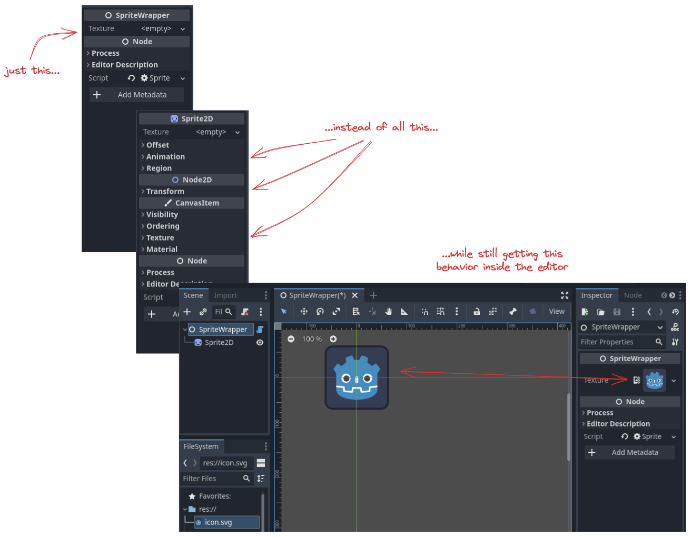
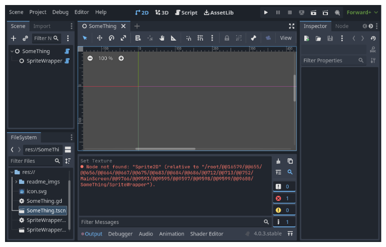
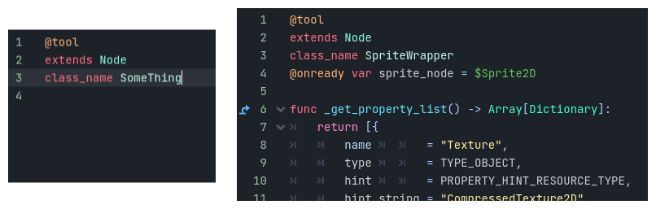
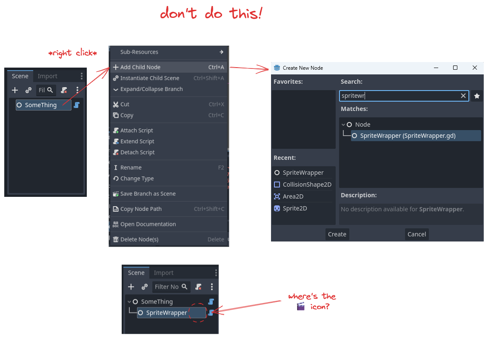
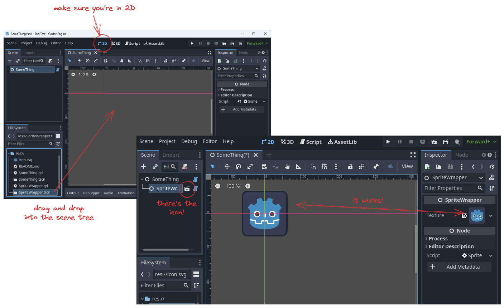

In Godot 4.0.3, `@tool` scripts seem to be unable to access the children of their scene trees when loaded as children in another scene.

`SpriteWrapper` is a scene that allows you to edit the texture of a `Sprite2D` without directly interacting with said `Sprite2D`:

Functionality works as desired when the scene itself is being modified, but including it as a child node in a different scene breaks this functionality:

Both scripts have the `@tool` designation:

So I don't know why it isn't working.

---

## Solution

Thanks to this input from the Godot Discord server:

    Looking at your screenshots, I don't see Sprite2D in the scene tree, and there's no scene branch icon next to SpriteWrapper. Are you sure it's there?

The `SpriteWrapper` scene was added to `SomeThing` by right-clicking the root node of `SomeThing` and selecting "Add a Child":

To fix it, create the `SpriteWrapper` child node by *dragging and dropping* the scene from the file explorer into the tree:

